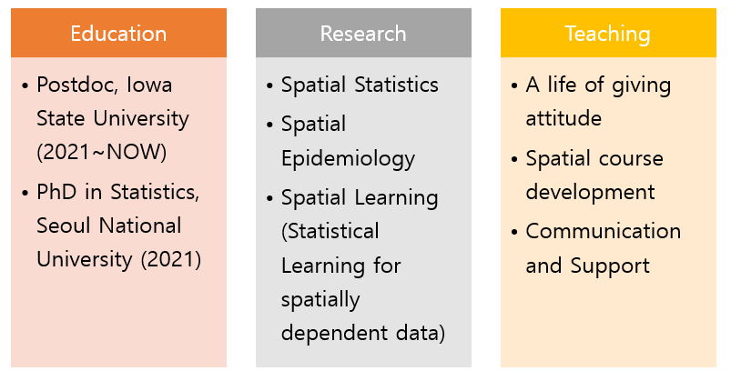

## About

<!--  -->

Yoon Bae Jun (1990-) is currently an assistant professor at the Biostatistics Division, School of Public Health, University of Nevada Reno. Jun earned a Ph.D. in Statistics, at Seoul National University (2021), and worked as a Postdoc Research Associate at the Department of Statistics at Iowa State University (2021-2023). 

Jun has been studying Spatial Statistics, Spatial Epidemiology, Environmental Epidemiology, and Statistical Learning methodology for spatially dependent data.

Jun teaches "SURVIVAL ANALYSIS FOR PUBLIC HEALTH (CHS 765)" and "APPLIED BAYESIAN STATISTICS (CHS 717)" as an instructor for a graduate at University of Nevada Reno. Also, Jun developed an online course, "INTRODUCTION TO HEALTH DATA ANALYSIS (CHS 381)" for an undergraduate (2024 Fall). Jun also  taught "Probability and Statistics for Computer Science (STAT 330)" as an instructor for an undergraduate in the Department of Computer Science at Iowa State University (Summer 2022)

### Contact

118 Savitt Medical Science \
Biostatistics Division \
University of Nevada, Reno \
RENO, NV 89557 \
Phone: (515) 708-5463 \
Email: yoonbaej@unr.edu

