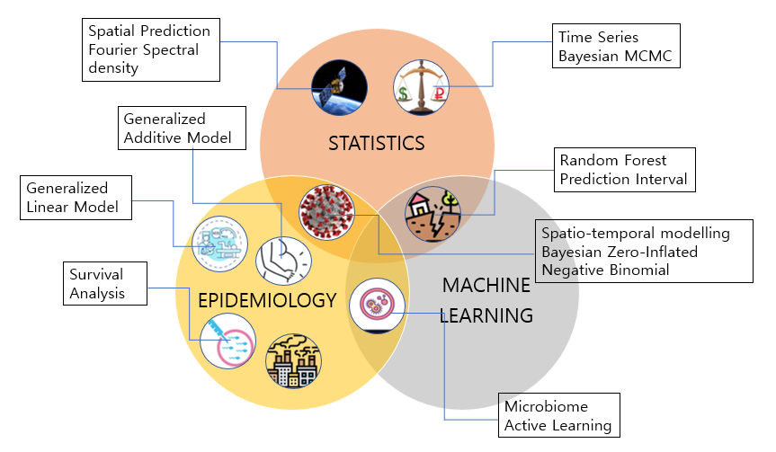

Google Scholar : [PUBLICATION](https://scholar.google.com/citations?user=uM0-oVcAAAAJ&hl=en)

Spatial or Spatio-temporal data are continuously gaining increasing interest, and it is now commonplace to consider geographical aspects of health outcomes with applications to public health and/or preventive medicine. For example, the world is experiencing the COVID-19 pandemic, a great threat to our public health, and we can study its mortality rate at the early stage considering the spatio-temporal correlation of the infectious disease over the regions[1](https://doi.org/10.1007/s13253-022-00487-1). I have been broadly studying theories, methodologies, and interdisciplinary applications that can be used to analyze such data within the disciplines of Statistics, Epidemiology, and Statistical Learning. Over the past 5 years, I have participated in various collaborating research such as air pollution epidemiology, remote sensing, microbiome data analysis, and tobacco health effect estimation.

## Highlights
* June, 2025: Invited Paper presentation, An Efficient Active Learning Design through Random Forest under Covariate Shift, 2025 KSS Spring Meeting
* March, 2025: Contributed Paper presentation, BSTZINB: A Bayesian Framework for Negative-Binomial Modeling of Spatio-Temporal Zero-Inflated Count Data in Epidemiology, ENAR 2025 Spring Meeting  
* October, 2024: Internal Grant recieved as Co-PI: SPH-UNR and SPH-UNLV Collaborating Projects, supported by School of Public Health, University of Nevada Reno

