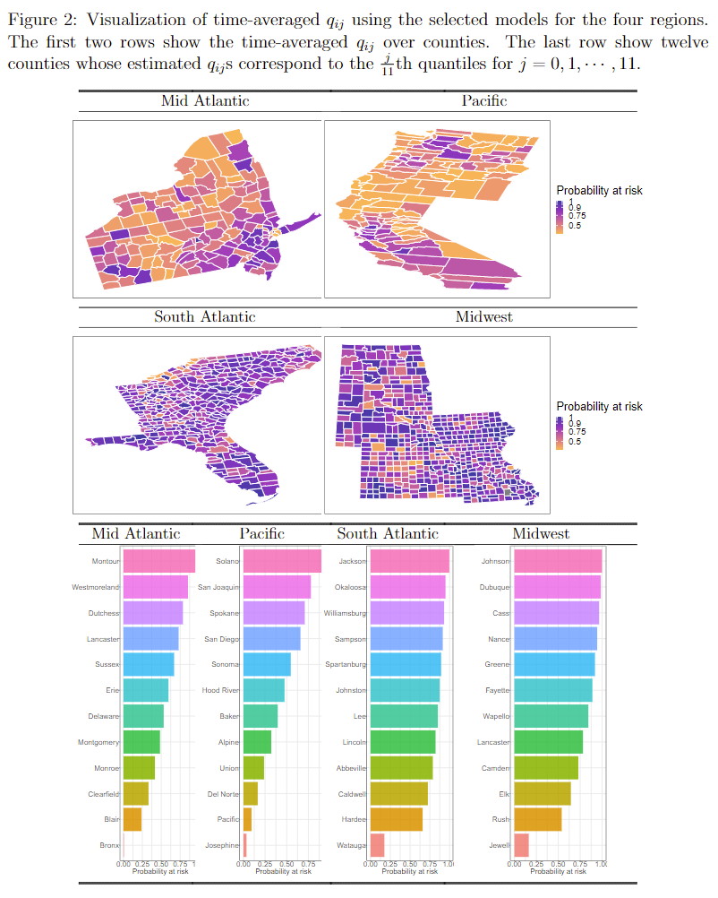

Air pollution such as particulate matter less than or equal to 10 $\mu m$ and 2.5 $\mu m$ in diameter (PM{\tiny 10} and PM{\tiny 2.5}) has been identified worldwide as one of the distinct risk factors for mortality and morbidity. I have been participating in collaborative research projects to evaluate the association between various health outcomes and individual-level air pollution exposure in South Korea. I have contributed several researches on the impact of long-term ambient air pollution concentration on maternal diseases such as [low birth weight](https://doi.org/10.1186/s12884-019-2401-9), [pre-eclampsia](https://doi.org/10.1186/s12884-018-1982-z), and [in-vitro fertilization](https://doi.org/10.1093/humrep/dey076). Also, we conducted a simulation study that is aimed at understanding the impact of the limited address information on health effect estimation of the model-predicted exposures under a few fixed monitoring designs [Jun, IS Song, OJ Kim and SY Kim (2022)](https://doi.org/10.1038/s41370-022-00412-1).

Many disease outcomes show heterogeneity over geographic regions, and one efficient way to estimate spatially varying prevalence is to find out spatially linked groups with common characteristics of disease risk. Dr. Lim (PhD advisor) and I suggested a spatially clustered disease mapping technique for a long-term individual cohort study to detect the effect of spatio-temporally correlated covariates as well as the cluster configuration of disease outcome of interest simultaneously. To be specific, we are developing a Bayesian survival model with cluster-wise varying regression parameters under a reversible-jump Markov Chain Monte Carlo (RJMCMC) framework. On the other hand, [Dr. Dey](https://datascience.harvard.edu/people/tanujit-dey) and other collaborators including me proposed to use a spatio-temporal Bayesian hierarchical model to estimate the association between exposure to fine particulate matter PM{\tiny 2.5} and mortality accounting for several social and environmental factors [Sounak, Dey, Jun, and Lim (2022)](https://doi.org/10.1007/s13253-022-00487-1). we are also building interactive web applications visualizing the geographic regional heterogeneity of it using [Github documents](https://github.com/junpeea/COVID-PM-STZINB) and [R-Shiny webpage](https://sounakchakraborty.shinyapps.io/covid_final_interface_software_101026/). 

## Bayesian Spatio Temporal Zero Inflated Negative Binomial
Paper  link : [Sounak, Dey, Jun, and Lim (2022)](https://doi.org/10.1007/s13253-022-00487-1)\
Github link : [BSTZINB](https://github.com/junpeea/COVID-PM-STZINB)\
Abstract :\
The world is experiencing a pandemic due to Severe Acute Respiratory Syndrome Coronavirus 2 (SARS-CoV-2), also known as COVID-19. The USA is also suffering from a catastrophic death toll from COVID-19. Several studies are providing preliminary evidence that short- and long-term exposure to air pollution might increase the severity of COVID-19 outcomes, including a higher risk of death. In this study, we develop a spatiotemporal model to estimate the association between exposure to fine particulate matter PM2.5 and mortality accounting for several social and environmental factors. More specifically, we implement a Bayesian zero-inflated negative binomial regression model with random effects that vary in time and space. Our goal is to estimate the association between air pollution and mortality accounting for the spatiotemporal variability that remained unexplained by the measured confounders. We applied our model to four regions of the USA with weekly data available for each county within each region. We analyze the data separately for each region because each region shows a different disease spread pattern. We found a positive association between long-term exposure to PM2.5 and the mortality from the COVID-19 disease for all four regions with three of four being statistically significant. Data and code are available at our GitHub repository. Supplementary materials accompanying this paper appear online.

## Bayesian Spatial Clutered Survival Modeling
Paper  link : (working in progress)\
Github link : (working in progress)\
Abstract :\
Spatially observed survival information can be analyzed by frailty models with spatially dependent random effects. Given spatial survival information, we are also interested in varying coefficients of a covariate to capture possible heterogeneous effects of the covariate. This leads us to develop a spatially clustered survival frailty model that allows different covariate effects by data-driven spatial clusters. Specifically, spatial clustering is based on the effect of a specific covariate on the log-hazard ratio, thereby capturing unobserved spatial heterogeneity by the covariatein the event occurrence process. The spatial dependency is further characterized by spatially dependent random effects. We use a Bayesian framework for spatial clustering and estimation. Through such modeling, we analyze survival data of small businesses from 35 developing commercial districts in Seoul to investigate the impact of the total de facto population surrounding each store on its survival. The results provide critical insights into variables affecting business closure, highlighting the significance of clusters and spatial factors in survival analysis.
